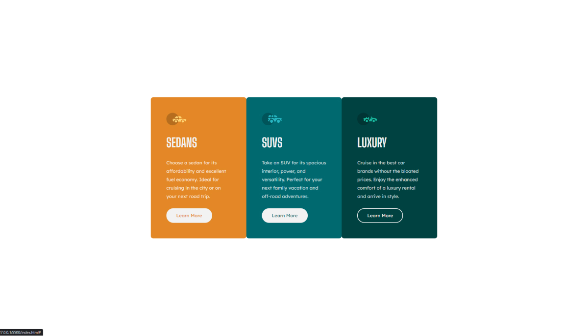

# Frontend Mentor - 3-column preview card component solution

This is a solution to the [3-column preview card component challenge on Frontend Mentor](https://www.frontendmentor.io/challenges/
3column-preview-card-component-pH92eAR2-). Frontend Mentor challenges help you improve your coding skills by building realistic projects.  

## Table of contents

- [Frontend Mentor - 3-column preview card component solution](#frontend-mentor---3-column-preview-card-component-solution)
  - [Table of contents](#table-of-contents)
  - [Overview](#overview)
    - [The challenge](#the-challenge)
    - [Screenshot](#screenshot)
    - [Links](#links)
  - [My process](#my-process)
    - [Built with](#built-with)
    - [What I learned](#what-i-learned)
    - [Continued development](#continued-development)
  - [Author](#author)
  - [Acknowledgments](#acknowledgments)
## Overview

### The challenge

Users should be able to:

- View the optimal layout depending on their device's screen size
- See hover states for interactive elements

### Screenshot



### Links

- Solution URL: [Add solution URL here](https://github.com/KrzysztofGrudzien/frontend-mentor-3-column-card-component)
- Live Site URL: [Add live site URL here](https://krzysztofgrudzien.github.io/frontend-mentor-3-column-card-component/)

## My process

### Built with

- Semantic HTML5 markup
- CSS custom properties
- CSS Grid
- Mobile-first workflow
- BEM Methodology

### What I learned

In this project, I tried to repeat my knowledge about pure HTML and CSS. As an additional tip, I used CSS properties and BEM Methodology.

Few lines of code from the project:

```html
<main class="cards">
    <div class="card card--primary">
        
        <h2 class="card__title">Sedans</h2>
        <p class="card__description">
            Choose a sedan for its affordability and excellent fuel economy. Ideal for cruising in the city or
            on your next road trip.
        </p>
        <a href="#" class="card__link card__link--primary">Learn More</a>
    </div>
    <div class="card card--secondary">
        
        <h2 class="card__title">SUVs</h2>
        <p class="card__description">
            Take an SUV for its spacious interior, power, and versatility. Perfect for your next family vacation
            and off-road adventures.
        </p>
        <a href="#" class="card__link card__link--secondary">Learn More</a>
    </div>
    <div class="card card--tertiary">
        
        <h2 class="card__title">Luxury</h2>
        <p class="card__description">
            Cruise in the best car brands without the bloated prices. Enjoy the enhanced comfort of a luxury
            rental and arrive in style.
        </p>
        <a href="#" class="card__link card__link--tertiary">Learn More</a>
    </div>
</main>
```
```css
:root {
    /* ------- COLORS ------- */
    --color-primary: hsl(31, 77%, 52%);
    --color-secondary: hsl(184, 100%, 22%);
    --color-secondary-dark: hsl(179, 100%, 13%);
    --color-text-darker: hsla(0, 0%, 100%, 0.75);
    --color-text: hsl(0, 0%, 95%);
    --color-hover: hsla(0, 0%, 0%, 0);

    /* ------- RADIUS ------- */
    --radius-8: 8px;
    --radius-25: 25px;
}

/* ------- BASIC ------- */

html {
    box-sizing: border-box;
    font-size: 62.5%;
}

*,
*:before,
*:after {
    box-sizing: inherit;
}
```

### Continued development

## Author

- Website - [In progress]
- Frontend Mentor - [@KrzysztofGrudzien](https://www.frontendmentor.io/profile/KrzysztofGrudzien)
- E-mail - krzysztof.grudzien.fed@gmail.com

## Acknowledgments
